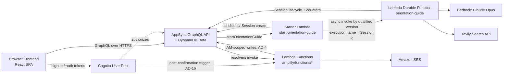
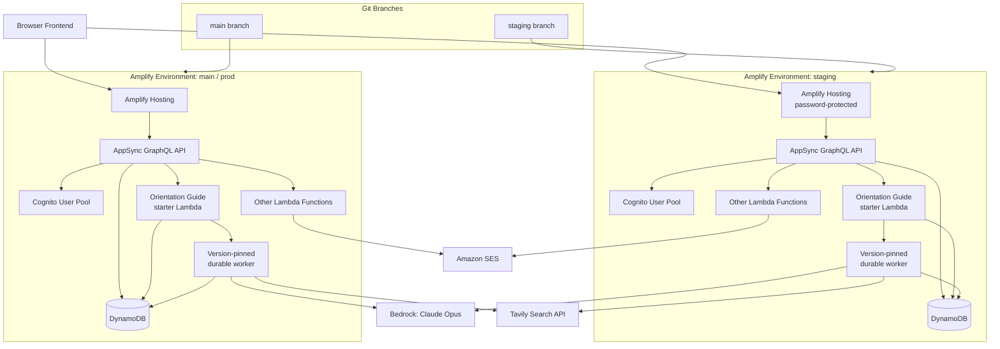
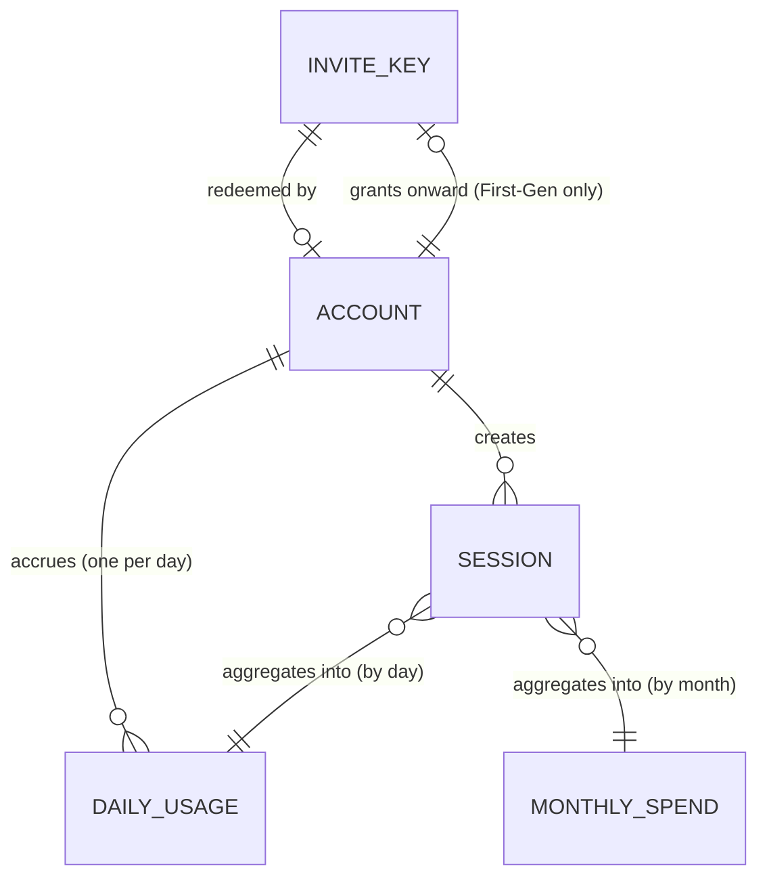

# Architecture Spine — tarot-spa Multiuser Accounts + LLM Orientation Guide

## Design Paradigm

Thin Lambda capability boundaries, no repository/DI abstraction layers. Short-lived backend capabilities remain a single Amplify Gen 2 Lambda invoked from an AppSync resolver or Cognito trigger. A long-running capability may use one thin synchronous API adapter plus one durable worker when its execution cannot safely fit inside the caller's response boundary. The Orientation Guide is that exception: `start-orientation-guide` owns request acceptance and `orientation-guide` owns durable generation. No service layer, repository/DAO abstraction, or dependency-injection container is introduced. This mirrors the frontend's minimal-abstraction style rather than introducing backend patterns foreign to the rest of the codebase.

Maps to the `amplify/` directory:

- `amplify/auth/resource.ts` + `amplify/auth/post-confirmation/` — Cognito User Pool config (incl. admin group/claim) and the InviteKey-redemption trigger (AD-16)
- `amplify/data/resource.ts` — AppSync GraphQL schema + DynamoDB models + owner-based/admin-group authorization rules
- `amplify/functions/<capability>/` — one directory per Lambda boundary (`resource.ts` + `handler.ts`); no shared abstraction layer between them. Long-running Orientation Guide execution uses `start-orientation-guide/` plus the durable `orientation-guide/` worker.
- `amplify/backend.ts` — wires auth + data + functions together

## Invariants & Rules



### AD-1 — Frontend stack stays as-is [ADOPTED]

- **Binds:** `src/**` (all frontend code)
- **Prevents:** introducing TypeScript, PropTypes, a component library, or other runtime tooling changes without an explicit decision
- **Rule:** the frontend remains React 19.2 + Vite 7.3 + Tailwind CSS v4 (CSS-first, no `tailwind.config.js`) + plain JS/JSX, per the Stack table. Amplify Gen 2's TypeScript-as-code backend definitions in `amplify/` are a separate concern and do not extend TypeScript into `src/`.

### AD-2 — GitHub-Pages base path is retired, not carried forward

- **Binds:** `vite.config.js`, all routing/asset/URL handling, AD-11's hosting migration
- **Prevents:** carrying the GH-Pages-era `/tarot-spa/` subpath into Amplify Hosting, and the opposite mistake of a naive absolute-path/router config that 404s under whatever path is actually live
- **Rule:** `vite.config.js`'s `base: '/tarot-spa/'` is dropped to `/` as part of the Amplify Hosting migration (AD-11). Old links/bookmarks under the `/tarot-spa/` prefix break — accepted, confirmed by Tony, given the scope of this release. Every new route and asset reference is built against a root-relative `/` base.

### AD-3 — Backend starter: AWS Amplify Gen 2

- **Binds:** all backend work (auth, data, functions, hosting)
- **Prevents:** hand-rolled API Gateway REST + a separately wired database + separately integrated Cognito
- **Rule:** Cognito Auth + AppSync GraphQL/DynamoDB Data + Lambda Functions, including Lambda Durable Functions, are defined together as TypeScript-as-code in `amplify/`, provisioned as one Amplify Gen 2 backend.

### AD-4 — Design-paradigm enforcement: no abstraction layers

- **Binds:** `amplify/functions/**`
- **Prevents:** introducing a repository/DAO layer, service layer, or DI container inside Lambda functions; Lambda writes silently bypassing or duplicating the client-facing authorization model
- **Rule:** each Lambda boundary implements exactly one responsibility and calls DynamoDB or its provider directly; no shared abstraction layer exists between functions beyond plain utility code. A long-running capability may split into a synchronous adapter and durable worker without adding a service tier. Server-side writes use IAM-authorized, function-scoped access, never client-facing owner mutations. For Orientation Guide generation, `start-orientation-guide` receives only Session create/read/update and qualified worker-invoke grants; `orientation-guide` receives Session read/update, DailyUsage/MonthlySpend read/write, Config read, Bedrock invoke, and Tavily-secret access. The usage-counter Lambda remains a separate read-only status capability. AD-9 governs browser access; Lambda writes are governed by their per-function IAM grants.

### AD-5 — LLM + Current-Events grounding split

- **Binds:** FR-8 (Orientation Guide generation)
- **Prevents:** adopting Bedrock AgentCore's agent-runtime layer or Nova Web Grounding's built-in search tool for this capability
- **Rule:** the durable Orientation Guide worker calls Tavily directly in an explicit durable step, then calls Claude Opus via Bedrock in a subsequent durable step with the results included in the prompt. Grounding remains a manual two-step flow, not a Bedrock-native tool call. Implementation note: current-generation Claude Opus on Bedrock requires an inference-profile identifier rather than a bare foundation-model ID for most versions/regions (Opus 4.5/4.6 always; Opus 4.7/4.8 outside select regions) — resolve the correct identifier for the chosen Opus version/region at implementation time.

### AD-6 — Rate-limit + budget enforcement: two-phase atomic reservation

- **Binds:** FR-9 (Daily Orientation Limit), FR-10 (aggregate monthly budget ceiling)
- **Prevents:** a plain check-then-act race where concurrent requests all pass a pre-call limit check before any of them increments it (the exact race `review-edge-case.md` flagged); relying on AWS Budgets alone as the blocking mechanism (its billing data lags too far behind real time to gate individual requests); client-side-only enforcement
- **Rule:** two phases, each a conditional `TransactWriteItems` operation over MonthlySpend + DailyUsage with a stable request-scoped `ClientRequestToken` (never a separate read-then-write or retry of a naked numeric update):
  1. **Pre-flight reservation**, before drawing or calling Tavily/Bedrock: atomically check-and-increment MonthlySpend by a fixed per-request cost estimate (~$0.03, matching the Opus per-request math in Deferred) and DailyUsage by 1 against the same Config snapshot (AD-13). MonthlySpend is transaction item 0 so its cancellation reason takes precedence when both limits are exhausted. Retrying an ambiguous response reuses the identical token and cannot double-increment.
  2. **Compensating rollback**, only on a server-side draw exception, outright Tavily exception, or outright/invalid Bedrock completion (not a Tavily timeout — see AD-14, which still produces a delivered Guide and is a confirmed successful completion): atomically decrement both reservations together with a second stable token distinct from the reservation token. Ambiguous retries reuse the rollback token and cannot double-decrement.

  Under AD-19, the stable tokens are derived deterministically by removing dashes from the UUID Session id and appending `RES` for reservation or `RBK` for compensation. Each token is 35 characters, within DynamoDB's 36-character `ClientRequestToken` limit. Every replayable step is independently safe for at-least-once execution; durable execution identity does not make external side effects exactly-once automatically.
  
  MonthlySpend is intentionally an estimate-based real-time gate, not a precise post-call ledger reconciled to actual billed cost — AWS Budgets + SNS remains the secondary safety net that catches estimate-vs-actual drift over time (not the primary blocking mechanism).

### AD-7 — Calendar-day boundary: UTC

- **Binds:** FR-9, DailyUsage
- **Prevents:** per-user timezone logic in v1
- **Rule:** the Daily Orientation Limit's "calendar day" resets at UTC midnight for every Account, regardless of the user's local timezone.

### AD-8 — Data model & composite keys

- **Binds:** `amplify/data/resource.ts`
- **Prevents:** ad-hoc or per-feature key schemes
- **Rule:** the model set is fixed at Account (incl. `generation`, `onwardKeyGenerated` — AD-17), InviteKey, Session, DailyUsage (key `accountId#date`, UTC date), MonthlySpend (key `year-month`, UTC), Config — no additional top-level models without a new decision. Session is the durable execution record: its id is the client request id and durable execution name; `status` is `PENDING | RUNNING | SUCCEEDED | FAILED`; `errorCode` and `completedAt` are optional; result fields remain optional until `SUCCEEDED`. Pre-lifecycle Sessions are backfilled or unambiguously treated as `SUCCEEDED`.

### AD-9 — Authorization: owner-based + admin group split [ADOPTED]

- **Binds:** Account, Session, DailyUsage records; MonthlySpend; Admin Dashboard queries and key-minting
- **Prevents:** hand-rolled per-request authorization checks duplicating Cognito identity, any Account (including admin) reading another Account's data via a per-record path, and MonthlySpend being given an owner-based rule it structurally can't have (it's a cross-account aggregate with no owning identity)
- **Rule:** Amplify Data's owner-based authorization rule gates Account/Session/DailyUsage records to their owning Cognito identity. Session remains owner-readable and never browser-writable in every lifecycle state. Only the starter and durable worker receive scoped Session write grants. MonthlySpend gets no owner-based rule: read access is admin-group-gated via Amplify Data auth, write access is restricted to the durable orientation-guide worker's IAM grant (AD-4). Admin Dashboard/key-minting capability is gated via a Cognito group or custom claim, never by relaxing per-record ownership.

### AD-10 — Admin Dashboard is aggregate-only

- **Binds:** FR-11 (Admin Dashboard)
- **Prevents:** building any raw-content viewer (an individual Account's Context or Orientation Guide text) into the Admin Dashboard
- **Rule:** Admin Dashboard queries return only aggregate metrics — user counts by generation, `SUCCEEDED` Session counts, Daily Orientation Limit hit-rate, spend-to-date — never a single Account's Context or Guide content. `PENDING` and `FAILED` lifecycle records do not inflate delivered-Guide metrics.

### AD-11 — Deployment: staging + main branch-per-environment

- **Binds:** all backend + hosting deployment
- **Prevents:** testing auth/data/LLM-spend changes directly against production; the old GH-Pages pipeline silently surviving alongside the new one
- **Rule:** `staging` is a fully isolated Amplify environment (own Cognito pool, own DynamoDB tables, own Lambda, password-protected URL); changes land on `staging` first and promote to `main` (prod) by merge. Amplify Hosting on `main` fully replaces GitHub Pages — the existing `.github/workflows/deploy.yml` → GH Pages pipeline is retired, not kept as a parallel/fallback path. Base path drops to `/` per AD-2. Production durable executions target a numbered function version or controlled alias; `$LATEST` is not used because a deployment must not change code beneath an active execution.

### AD-12 — Draw-code sharing mechanism stays as-is

- **Binds:** Quick Draw (public + authenticated)
- **Prevents:** conflating Quick Draw's client-only sharing with the new Session persistence model, or routing Quick Draw through the new backend
- **Rule:** the existing `encodeDraw`/`decodeDraw` (client-only, no server) remains the sharing mechanism for Quick Draw exactly as it exists today; Orientation Guide Sessions use the new persisted Session model instead — the two do not share a code path.

### AD-13 — Limit/budget config is data, not code

- **Binds:** FR-9 (Daily Orientation Limit), FR-10 (monthly budget ceiling)
- **Prevents:** hardcoding the daily-limit or monthly-budget values in Lambda code, requiring a deploy to change them
- **Rule:** a single `Config` item in DynamoDB (`dailyLimit`, `monthlyBudget` fields) is the source of truth. The durable orientation-guide worker reads it once per generation execution and checkpoints the snapshot; both DailyUsage and MonthlySpend reservation checks (AD-6) use that same snapshot, never independent re-reads. The read-only usage-counter status Lambda reads the same item for presentation status. The Admin Dashboard exposes a plain field to edit it, with no separate config service or feature flag system.

### AD-14 — Tavily slow-but-not-failed handling

- **Binds:** FR-8 (Orientation Guide generation), the Current-Events grounding step (AD-5), the AD-6 reservation/rollback protocol
- **Prevents:** the Orientation Guide Lambda hanging indefinitely on a slow (but not erroring) Tavily response; a timeout-triggered ungrounded Guide being mistaken for a failure and rolled back, which would create a free/uncounted-request path (repeatedly timing out to dodge FR-9/FR-10)
- **Rule:** the Tavily durable step carries a 20-second timeout; on timeout, the worker proceeds to the Claude Opus generation step without Current-Events grounding rather than blocking. This is a confirmed successful completion for AD-6's counter purposes, not a failure — the AD-6 rollback carve-out applies only to an outright Tavily exception or outright Bedrock/Claude failure, never a timeout-with-fallback. User-facing copy on this path is playful, not a dry error — Tony's framing: "the news is slow today, ha ha."

### AD-15 — Request-Access email via Amazon SES

- **Binds:** FR-5 (Request-access form)
- **Prevents:** adding a non-AWS third-party form/email service for one small feature
- **Rule:** a `request-access` Lambda sends the submitted name + email to Tony's cutout address via Amazon SES. SES starts in sandbox mode, requiring the recipient (cutout) address to be verified once before delivery works — a one-time setup step, not an ongoing operational cost.

### AD-16 — Invite Key redemption is a Cognito-trigger atomic write

- **Binds:** FR-1 (Account creation via Invite Key)
- **Prevents:** concurrent redemption of the same key creating two Accounts; a Cognito signup succeeding while the key-redeemed write fails (or vice versa), leaving an orphaned Cognito user or a stuck key state; the same person redeeming multiple keys to run multiple Accounts against the per-Account Daily Orientation Limit
- **Rule:** redemption is a single atomic conditional `UpdateItem` on InviteKey (`ConditionExpression: status = unredeemed`, set to `redeemed`), performed inside a Cognito post-confirmation Lambda trigger — the idiomatic Amplify Gen 2 mechanism, not a separate API call the client orchestrates. If the conditional write fails (the key was already redeemed or revoked by a concurrent request), the trigger rejects the signup so Cognito and InviteKey state never diverge; Cognito and InviteKey are never independently "correct." Same-identity multi-key redemption is prevented by a verified-email uniqueness check across Accounts before the trigger allows signup to complete.

### AD-17 — Onward-key-mint eligibility is a single atomic check

- **Binds:** FR-2 (First-Gen grant capability), FR-3 (Tony-issued keys)
- **Prevents:** a Second-Gen account minting an onward key (defeating the two-generation cap); duplicate onward-key minting from one First-Gen account via a double-click/duplicate-submit
- **Rule:** Account gets an `onwardKeyGenerated: boolean` field (extends AD-8). The invite-key-mint Lambda's onward-key path performs one atomic conditional `UpdateItem` on the requesting Account — `ConditionExpression: generation = FirstGen AND onwardKeyGenerated = false`, setting `onwardKeyGenerated = true` — in the same transaction as creating the new InviteKey record; eligibility is never derived by querying existing InviteKey records. Tony's own direct admin-mint path (FR-3) is a separate mutation on the same `invite-key-mint` Lambda, gated only by AD-9's admin-group check — no `generation`/`onwardKeyGenerated` condition applies to it.

### AD-18 — Admin Dashboard aggregates are computed by a dedicated Lambda

- **Binds:** FR-11 (Admin Dashboard)
- **Prevents:** client-side aggregation over paginated Amplify Data list queries (which would also require relaxing AD-9's authorization model to let the client read cross-account records directly)
- **Rule:** an `admin-metrics` Lambda computes the FR-11 aggregates (users by generation, `SUCCEEDED` Session counts, Daily Orientation Limit hit-rate, spend-to-date vs. Config's `monthlyBudget`) server-side, following the thin capability-boundary paradigm (AD-4). `PENDING` and `FAILED` lifecycle records are excluded from delivered-Guide counts. The Admin Dashboard's frontend calls this Lambda rather than issuing raw list queries against Account/Session/MonthlySpend.

### AD-19 — Durable asynchronous Orientation Guide execution

- **Binds:** FR-8 (Orientation Guide generation), Session, `startOrientationGuide`, `start-orientation-guide`, `orientation-guide`, client completion tracking
- **Prevents:** successful paid work being reported as an AppSync timeout; the browser resubmitting ambiguous work; newest-Session inference selecting the wrong result; deployments changing code beneath active executions
- **Rule:** AppSync invokes `start-orientation-guide`, never the long-running worker directly. The client generates a UUID request id. The starter validates authentication, Context, Spread, and idempotency; conditionally creates a caller-owned `PENDING` Session whose id equals that request id; invokes a numbered version or controlled alias of the durable worker asynchronously with the same durable execution name; and returns a typed `{ sessionId, status }` acknowledgment without waiting for generation.

  Reusing a request id with identical owner and inputs returns the existing Session acknowledgment. Reusing it with different inputs returns `IDEMPOTENCY_CONFLICT`.

  The durable worker input contains only the Session id. Context and Spread are loaded from the owner-bound Session rather than copied through execution input. The normal lifecycle transitions through `RUNNING` to exactly one terminal state. Expected failures become stable public error codes only after required compensation completes. The Config snapshot and all state-changing provider/data boundaries are durable steps with replay-safe behavior per AD-6.

  A parked `RUNNING` Session is the sole explicit exception: it means successful provider output could not be persisted after retries, or required compensation could not be confirmed. The worker rethrows so the native Lambda Errors alarm notifies Tony by SNS/email. Tony owns acknowledgment within one hour and reconciliation within one business day under `docs/orientation-guide-reconciliation.md`. Parked records are excluded from delivered-Guide metrics and are ineligible for Story 3.5 judging until reconciled to `SUCCEEDED` or `FAILED`. Operations use Session id and durable metadata only; Context, evidence, prompts, and Guide bodies never enter alerts, logs, or tickets.

  The browser polls only `Session.get(sessionId)` and persists only the active id for reload recovery. An ambiguous start response is resolved by reading that already-known id before another submission is allowed. Listing Sessions or choosing a result by `createdAt` is prohibited. The active id is cleared on sign-out, confirmed terminal failure, or deliberate exit from Results. Reaching the 300-second client observation boundary is indeterminate: polling stops, truthful recovery copy appears, and the exact id remains available for an explicit later check. No arbitrary Session-history surface is introduced.

  Durable execution history and logs use least-privilege IAM, encrypted AWS storage, short retention, and no Context, Tavily evidence, prompt, or Guide bodies in CloudWatch logs.

## Consistency Conventions

| Concern | Convention |
| --- | --- |
| Naming (entities, files, interfaces, events) | Amplify Data model names PascalCase singular (`Account`, `InviteKey`, `Session`, `DailyUsage`, `MonthlySpend`); Lambda function directories kebab-case under `amplify/functions/<capability-name>/`; frontend keeps its existing convention unchanged — PascalCase component files/functions, camelCase utils/data functions, SCREAMING_SNAKE_CASE exported constants [ADOPTED] |
| Data & formats (ids, dates, error shapes, envelopes) | `DailyUsage` primary key `accountId#date` (date = UTC `YYYY-MM-DD`); `MonthlySpend` primary key `year-month` (UTC `YYYY-MM`); all stored timestamps are UTC ISO-8601; `Account` id is the Cognito identity `sub`; Orientation Guide `requestId`, Session id, and durable execution name are the same UUID |
| State & cross-cutting (mutation, errors, logging, config, auth) | Auth: Amplify Data owner-based rule for user-owned records, admin-group-gated for MonthlySpend/Admin Dashboard, Lambda writes via per-function IAM grants not client mutations (AD-4, AD-9). Orientation Guide: `PENDING → RUNNING → SUCCEEDED | FAILED`; client polls exact Session id; durable steps are independently idempotent; production executions are version-pinned; sensitive payload bodies are not logged (AD-19). Counters: DailyUsage/MonthlySpend reserved atomically pre-flight, rolled back only on outright Tavily/Bedrock failure — a Tavily timeout still counts as success (AD-6, AD-14). InviteKey redemption and onward-key minting are each a single atomic conditional `UpdateItem`, never read-then-write (AD-16, AD-17). Config: Daily Orientation Limit and monthly budget ceiling live in a single DynamoDB `Config` item, read and checkpointed once per generation, edited via the Admin Dashboard (AD-13) |

## Stack

| Name | Version |
| --- | --- |
| AWS Amplify Gen 2 (code-first TypeScript backend: Cognito Auth, AppSync/DynamoDB Data, Lambda Functions) | Gen 2 (current paved path, verified 2026-07-10) |
| AWS Lambda Durable Functions + JavaScript/TypeScript durable execution SDK | Code-first durable Orientation Guide worker (AD-19) |
| Claude Opus (via Bedrock) | Opus 4.x family, Bedrock Converse API |
| Tavily Search API | Basic Search tier (1,000 free credits/month, $0.008/credit thereafter) |
| Amazon SES | Sandbox mode initially (recipient verification required once) |
| React + React DOM | 19.2.0 |
| Vite (`@vitejs/plugin-react`) | 7.3.1 (`@vitejs/plugin-react` 5.1.1) |
| Tailwind CSS (`@tailwindcss/vite`) | 4.2.0 (CSS-first config) |
| ESLint | 9.39.1 (flat config) |

## Structural Seed





```text
tarot-spa/
  amplify/                       # Amplify Gen 2 backend, TypeScript-as-code
    auth/
      resource.ts                # Cognito User Pool + admin group/claim
      post-confirmation/         # AD-16: atomic InviteKey redemption trigger
        resource.ts
        handler.ts
    data/
      resource.ts                # AppSync schema, DynamoDB models, owner-based + admin-group auth rules
    functions/
      start-orientation-guide/   # AD-19: validate, conditionally create PENDING Session, invoke worker, acknowledge
        resource.ts
        handler.ts
      orientation-guide/         # AD-19 durable worker: reserve -> Draw -> Tavily -> Bedrock -> terminal Session
        resource.ts
        handler.ts
      invite-key-mint/           # FR-2, FR-3: onward-key eligibility check (AD-17), Tony's direct admin mint
        resource.ts
        handler.ts
      usage-counter/             # FR-9 presentation status: read-only DailyUsage + Config query
        resource.ts
        handler.ts
      request-access/            # FR-5: sends name + email to Tony's cutout address via SES
        resource.ts
        handler.ts
      admin-metrics/             # FR-11: aggregate dashboard metrics (AD-18)
        resource.ts
        handler.ts
    backend.ts                   # wires auth + data + functions together
  src/                           # existing brownfield frontend, unchanged conventions
    components/                  # flat, PascalCase, one level deep
    utils/                       # flat, camelCase (incl. existing encodeDraw/decodeDraw)
    data/                        # FULL_DECK, SPREADS, etc.
    App.jsx
  vite.config.js                 # base: '/' (dropped from '/tarot-spa/' per AD-2)
```

## Deferred

- Third-generation+ invite chains — out of v1 scope per prd.md §7/§8.2; revisit if Second-Gen accounts prove highly active.
- Paid tier / billing — undesigned per prd.md §6/§8.2; gated on a real demand signal (unprompted key requests), not a v1 requirement.
- Per-user timezone capture/display for limit-reset and timestamps — explicitly "not for now" (memlog); UTC-everywhere (AD-7) holds until then.
- Survey / Follow-Up Nudge tooling — cut from v1 scope entirely per prd.md §8.2 and Glossary; Tony follows up with early users manually at friend-circle scale.
- Multi-admin / role-based admin access — out of scope per prd.md §7/§8.2/FR-11; Tony is sole admin in v1.
- Native mobile apps — out of scope per prd.md §7; single responsive web surface only (EXPERIENCE.md Foundation).
- Data retention/deletion controls, encryption-at-rest requirements, breach/incident-response procedures — accepted hobby-tier risk per prd.md §6/§8.2; revisit before any broader (non-friend-circle) opening.
- Claude Opus model-tier choice revisit — accepted now on real expected-usage math (~$13–18/month at ~450–600 requests/month), but flagged for revisit if usage approaches the ~1,000 requests/month ceiling under the $30 FR-10 budget (memlog).
